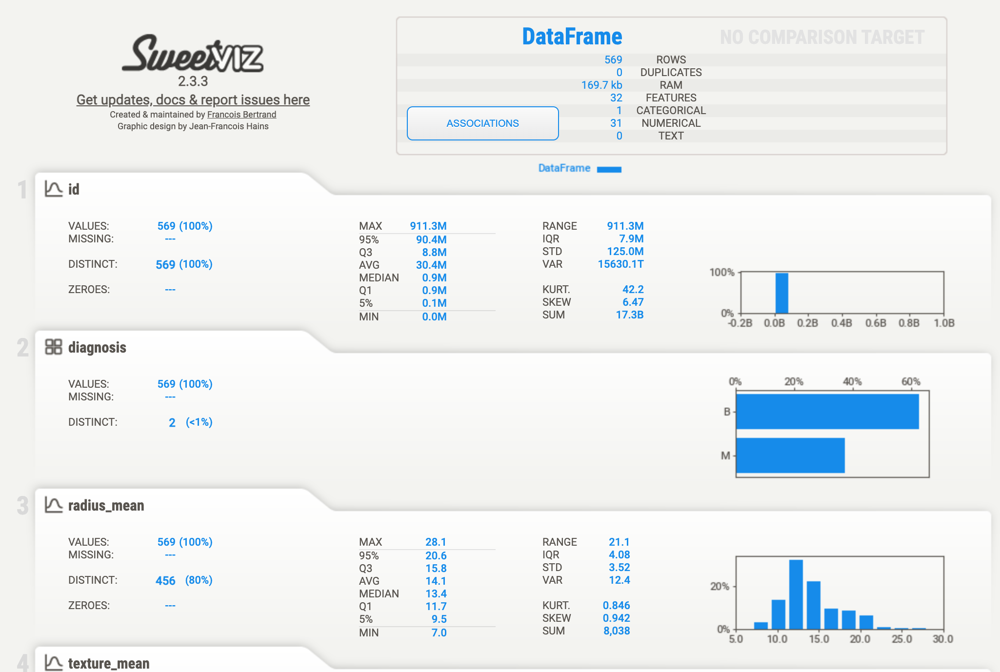

# Análise exploratória de dados: diagnóstico de câncer de mama

Projeto do módulo **Visualização e Storytelling de Dados** (Leega Academy). O cenário é uma simulação: um hospital quer entender uma base de diagnósticos de câncer de mama antes de usá-la para alimentar seus algoritmos de IA. O foco é nos **insights** e na forma de comunicá-los, não na complexidade de modelos.

## Pergunta de negócio

O hospital levantou cinco perguntas:

1. Como as amostras se distribuem entre câncer benigno e maligno?
2. Como se distribuem as variáveis numéricas?
3. Quais são os outliers, já que os dados alimentarão algoritmos de IA?
4. Qual a matriz de correlação, para saber quais variáveis importam?
5. Como oferecer aos médicos um painel exploratório baseado em estatística descritiva?

## Dados

- **Base:** Breast Cancer Wisconsin (Diagnostic), 569 amostras e 30 variáveis numéricas.
- **Origem:** medidas dos núcleos celulares calculadas a partir de imagens digitalizadas de punção aspirativa por agulha fina (PAAF).
- **Alvo:** `diagnosis` (`B` = benigno, `M` = maligno).
- **Variáveis:** 10 características (raio, textura, perímetro, área, suavidade, compacidade, concavidade, pontos côncavos, simetria, dimensão fractal), cada uma em três versões: média (`_mean`), erro padrão (`_se`) e pior valor (`_worst`).
- **Limpeza:** remoção de `id` (identificador) e `Unnamed: 32` (coluna vazia). Não há valores ausentes nas demais colunas.
- **Fonte:** Wolberg, W., Mangasarian, O., Street, N., Street, W. (1995). *Breast Cancer Wisconsin (Diagnostic)*. UCI Machine Learning Repository. https://doi.org/10.24432/C5DW2B

## Principais achados

| # | Pergunta | Resultado |
|---|---|---|
| 1 | Diagnóstico | 357 benignas (62,7%) e 212 malignas (37,3%). Desbalanceamento moderado. |
| 2 | Distribuições | Maioria com cauda longa à direita (só 4 das 30 variáveis são quase simétricas). O grupo maligno se desloca para valores maiores, sobretudo em tamanho e irregularidade dos núcleos. |
| 3 | Outliers | 171 amostras (30%) têm ao menos um valor fora do padrão (regra de Tukey, 1,5·IIQ). **77% dos pontos atípicos estão em casos malignos.** |
| 4 | Correlações | Mais associadas ao diagnóstico: `concave points_worst`, `perimeter_worst`, `concave points_mean`, `radius_worst` (r ≈ 0,78 a 0,79). Raio, perímetro e área são redundantes (r > 0,97). Há 21 pares com \|r\| > 0,9. |
| 5 | Painel | Painel interativo em HTML (ver abaixo) e relatório automático com Sweetviz. |

**Recomendações ao cliente**
- Não remover outliers automaticamente: tumores grandes e irregulares são clinicamente reais. Revisar os mais extremos com a equipe médica.
- Treinar a IA com 6 a 10 variáveis não redundantes (uma entre raio, perímetro e área, mais pontos côncavos e concavidade).
- Usar validação estratificada e avaliar por sensibilidade (recall), por causa do desbalanceamento.

## Estrutura do repositório

```
.
├── Cancer_Data.csv     # dados 
├── DataVizCancer.png         
├── DataViz_Cancer_EDA.ipynb           # análise completa (perguntas 1 a 4)
├── EAD_cancer.html         # relatório automático (pergunta 5)
├── README.md
└── painel_cancer_mama.html  # painel interativo (pergunta 5) 
```

## Como executar

```bash
git clone https://github.com/Engineer-Ana/dataviz-cancer-mama-eda.git
cd dataviz-cancer-mama-eda
pip install pandas numpy matplotlib seaborn sweetviz jupyter
jupyter notebook Datavis_Cancer_EAD.ipynb
```

No Google Colab, envie o `Cancer_Data.csv` para a sessão (ou use `!wget` com o link "raw" do arquivo neste repositório) antes de rodar o notebook.

Para gerar o relatório Sweetviz:

```python
import sweetviz as sv
relatorio = sv.analyze(df)                       # df = base já carregada
relatorio.show_html("relatorio_sweetviz_cancer.html")
```

## 📊 Análise Exploratória de Dados (EDA)

Foi gerado um relatório automatizado de estatística descritiva utilizando a biblioteca Sweetviz. O dashboard interativo apresenta mapas de calor, distribuição de variáveis e análise de correlação.

### Pré-visualização do Dashboard


## Ver online
- [Painel interativo](https://engineer-ana.github.io/LeegaAcademy-Datavis_Usando_Python/painel_cancer_mama.html)
- [Relatório Sweetviz](https://engineer-ana.github.io/LeegaAcademy-Datavis_Usando_Python/EAD_cancer.html)

Para cada medida escolhida, mostra:

- estatística descritiva por grupo (média, mediana, desvio, quartis, assimetria, outliers);
- histograma e boxplot comparando benignos e malignos;
- matriz de correlação clicável;
- gráfico de dispersão entre duas medidas.

O painel cobre as 10 variáveis `_mean`. O notebook analisa as 30.

## Tecnologias

Python, pandas, NumPy, Matplotlib, Seaborn, Sweetviz, HTML/CSS/JavaScript (painel).

## Limitações

- Análise **exploratória**: não há modelo preditivo nem validação clínica.
- Base pública e antiga, com 569 amostras: serve ao propósito didático, não à tomada de decisão médica.
- A associação entre variáveis e diagnóstico não implica causalidade.

## Autora

**Ana Maria Dias**, Engenheira de produção, Mestra em Engenharia Têxtil, em especialização em análise de dados.
[LinkedIn](https://www.linkedin.com/in/anamariadias) · [GitHub](https://github.com/Engineer-Ana)
